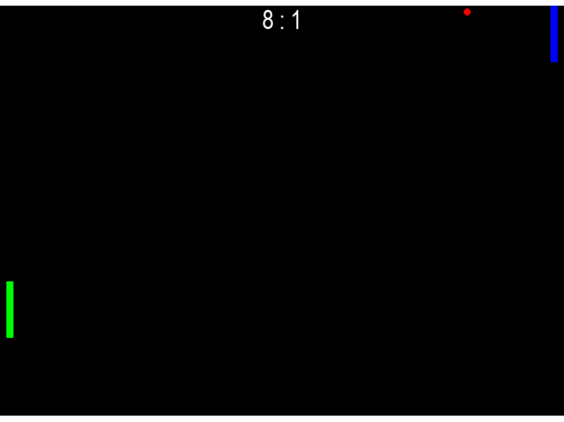

# Pong RL — Deep Q-Learning with MC-Dropout Exploration

> Кастомное окружение Pong на `gymnasium` + агент на базе DQN с нестандартным механизмом exploration через MC-Dropout (UCB), предобученный имитацией эвристики и дообученный онлайн-RL.

<h3 align="center">My_DQN gameplay</h3>
<p align="center">
  
</p>

<h3 align="center">Stable_baselines3 DQN gameplay</h3>
<p align="center">
  
</p>

---
## 🇷🇺 Русский

### О проекте

Цель проекта была не просто решить задачу, а спроектировать и обкатать нестандартный подход к exploration в DQN: вместо классического ε-greedy агент использует **MC-Dropout как оценку эпистемической неопределённости** и выбирает действия по принципу **UCB** (upper confidence bound), балансируя между ожидаемой ценностью действия и уверенностью сети в этой оценке.

### Цели проекта

- Реализовать среду Pong «с нуля» на `gymnasium` — с нормализованными наблюдениями, конфигурируемой сложностью соперника и режимом рендеринга.
- Реализовать и обучить DQN-агента, дообучаемого поверх imitation-learning предобучения на эвристике.
- Исследовать **MC-Dropout как источник exploration** в RL (альтернатива ε-greedy / bootstrapped DQN) — на практике разобраться, где эта идея работает, а где даёт неожиданные побочные эффекты (нестабильность обучения, коллапс политики).
- Довести агента до обыгрывания эвристического бейзлайна, не просто «играть», а находить нетривиальные стратегии (например, отбивать мяч краем ракетки ради ускорения).

### Что внутри

| Файл | Назначение |
|---|---|
| `env_pong.py` | Кастомное `gymnasium`-окружение Pong: физика мяча/ракеток, нормализованные наблюдения, режимы рендеринга и демо-матчей |
| `models.py` | Игроки: `Baseline` (эвристика — следование за мячом), `HumanPlayer`, `DQN_StBaselines3` (обёртка над `stable-baselines3`), `MyDQN` — основной агент |
| `mydqn_components.py` | `ReplayBuffer` и `Q_network` (MLP с dropout) |
| `pong_game.ipynb` | Ноутбук: сбор датасета на эвристике → предобучение (behavior cloning) → RL-дообучение → оценка |

### Архитектура и ключевые технические решения

**Наблюдение (state):** 6 нормализованных признаков — позиция мяча, скорость мяча по обеим осям, позиции обеих ракеток.

**Действия:** вниз / вверх / стоять.

**Пайплайн обучения:**
1. **Behavior cloning** — предобучение `Q_network` на датасете действий эвристики `Baseline` (imitation learning), чтобы дать агенту разумную стартовую точку и не учить базовым навыкам (следить за мячом) с нуля через RL.
2. **RL fine-tuning (DQN)** — дообучение на взаимодействии со средой:
   - **MC-Dropout UCB exploration** — при выборе действия сеть делает несколько stochastic forward-проходов (dropout включён), из разброса предсказаний считается оценка неуверенности, действие выбирается по `mean_Q + β(t)·std_Q`, где `β(t)` затухает со временем;
   - **ε-greedy поверх UCB** — дополнительный гарантированный источник разнообразия действий на старте обучения (нужен, чтобы уверенная после предобучения сеть не схлопывалась в одно действие);
   - **Double DQN** — снижение систематической переоценки Q-значений;
   - **Soft target update (Polyak averaging)** — плавное обновление target-сети вместо резкой периодической синхронизации;
   - **Reward shaping** — бонус за отбитие мячом ближе к краю ракетки (`0.3 · exp(|alpha|)`, где `alpha` — точка контакта), даёт мячу ускорение, против которого эвристика не успевает реагировать.

### Как запустить

```bash
pip install -r requirements.txt
```

Открыть `pong_game.ipynb` и последовательно выполнить ячейки: сбор датасета → предобучение → RL-дообучение → оценка (`env.demo()`).

Для визуальной демонстрации обученного агента:
```python
from env_pong import PongEnv
from models import MyDQN, Baseline

env = PongEnv(render_mode="human", opponent=Baseline(difficult=1))
stats = env.demo(left_player=agent)  # agent — обученный MyDQN
```

### Результаты

Агент обучен против эвристического бейзлайна (`Baseline(difficult=1)`), который следует за мячом и возвращается к центру поля. Итоговая политика находит и использует стратегию отбивания мяча краем ракетки, придающую дополнительное ускорение — против которого бейзлайн не успевает адаптироваться. Ровно ту же стратегию независимо нашла эталонная реализация DQN на `stable-baselines3`, обученная на той же reward-функции — это подтверждает, что найденная тактика объективно оптимальна против данного соперника, а не артефакт конкретной реализации.

| Метрика | Значение |
|---|---|
| Win rate против `Baseline(difficult=1)` | **~25% побед в отдельных розыгрышах** (110 из 300 - лучший статистически надёжный результат серии экспериментов) |
| Число шагов обучения (лучший чекпоинт) | 1 800 000 |
| Reward shaping | бонус за удар `0.3 · exp(\|alpha\|)`, где `alpha` — точка контакта мяча с ракеткой |
| Сравнение с `stable-baselines3` | сопоставимый результат на той же reward-функции, та же ключевая стратегия |

Матч целиком (серию розыгрышей до `n_rounds` очков) агент пока не выигрывает — набирает часть очков за счёт описанной тактики, но не доминирует полностью над бейзлайном.

### Возможные дальнейшие улучшения

- Bootstrapped DQN / ансамбль голов как более устойчивая альтернатива MC-Dropout для exploration.
- Prioritized Experience Replay.
- Обучение против нескольких уровней сложности эвристики / self-play.
