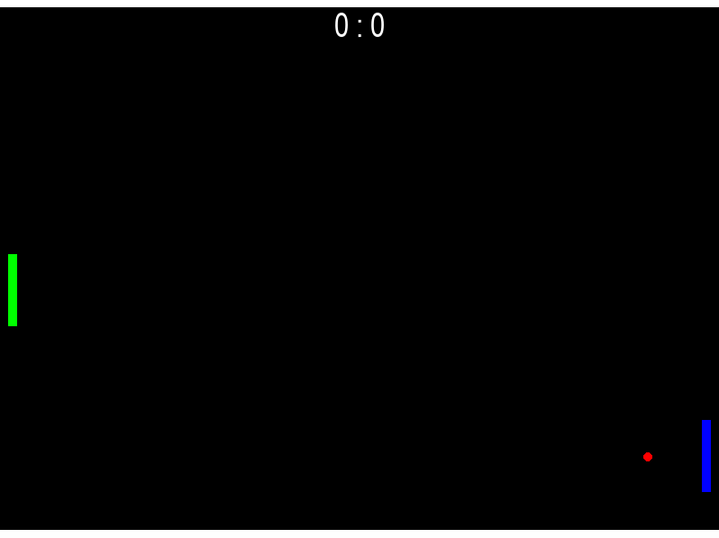
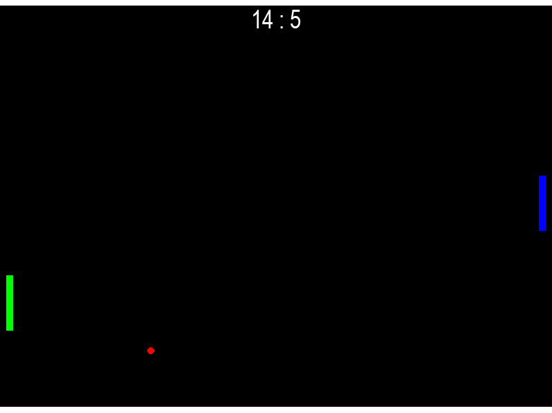

# Pong RL — Deep Q-Learning with MC-Dropout Exploration

> Кастомное окружение Pong на `gymnasium` с ускорением мяча при отбивании краем ракетки + агент на базе DQN с нестандартным механизмом exploration через MC-Dropout (UCB), предобученный имитацией эвристики и дообученный онлайн-RL.

<h3 align="center">My_DQN gameplay</h3>
<p align="center">
  
</p>

<h3 align="center">Stable_baselines3 DQN gameplay</h3>
<p align="center">
  
</p>
---

## 🇷🇺 Русский

### Содержание

- [О проекте](#о-проекте)
- [Цели проекта](#цели-проекта)
- [Что внутри](#что-внутри)
- [Архитектура и ключевые технические решения](#архитектура-и-ключевые-технические-решения)
- [Как запустить](#как-запустить)
- [Результаты](#результаты)
- [Графики обучения](#графики-обучения)
- [Выводы по итогам экспериментов](#выводы-по-итогам-экспериментов)
- [Возможные дальнейшие улучшения](#возможные-дальнейшие-улучшения)

### О проекте

Цель проекта была не просто решить задачу, а спроектировать и опробовать нестандартный подход к exploration в DQN: вместо классического ε-greedy агент использует **MC-Dropout как оценку неопределённости** и выбирает действия по принципу **UCB** (upper confidence bound), балансируя между ожидаемой ценностью действия и уверенностью сети в этой оценке.

### Цели проекта

- Реализовать среду Pong «с нуля» на `gymnasium` с нормализованными наблюдениями, конфигурируемой сложностью соперника и режимом рендеринга.
- Реализовать и обучить DQN-агента, дообучаемого поверх предобучения на эвристике.
- Исследовать **MC-Dropout как источник exploration** в RL (альтернатива ε-greedy) — на практике разобраться, где эта идея работает, а где даёт неожиданные побочные эффекты (нестабильность обучения, коллапс политики).
- Довести агента до обыгрывания бейзлайна и сравнить с эталонной реализацией DQN из `stable-baselines3`.

### Что внутри

| Файл / папка | Назначение |
| --- | --- |
| `env_pong.py` | Кастомное `gymnasium`-окружение Pong: физика мяча/ракеток, нормализованные наблюдения, режимы рендеринга и демо-матчей |
| `models.py` | Игроки: `Baseline` (эвристика — следование за мячом), `HumanPlayer`, `DQN_StBaselines3` (обёртка над `stable-baselines3`), `MyDQN` — основной агент |
| `mydqn_components.py` | `ReplayBuffer` и `Q_network` (MLP с dropout) |
| `pong_mydqn_training&stats.ipynb` | Основной ноутбук обучения: предобучение (behavior cloning) → RL-дообучение → графики метрик (EMA reward, loss history) |
| `pong_game_evaluation.ipynb` | Ноутбук для оценки агентов — загрузка сохранённого чекпоинта из `saved_models/` и прогон обученного агента без рендеринга (только для метрик) |
| `showcase.ipynb` | Ноутбук для визуальной демонстрации — рендер геймплея обученного агента, используется для записи гифок в `gifs/` |
| `pong_datasets/` | Датасет пар (state, action), собранный на эвристике `Baseline`, используется для behavior cloning предобучения `Q_network` |
| `saved_models/` | Сохранённые веса обученных агентов (чекпоинты `MyDQN`), включая лучшую модель по итогам экспериментов |
| `gifs_and_pictures/` | Гифки геймплея — `My_DQN.gif` (кастомный агент) и `Stable_Baselines3_DQN.gif` (эталонная реализация DQN для сравнения). Скриншоты Loss_history и EMA Reward для MyDQN|
| `other/` | История loss (`loss_history`) по обучающим прогонам — сохранена отдельно для построения графиков без повторного запуска обучения |
| `requirements.txt` | Список зависимостей проекта для воспроизведения окружения (`pip install -r requirements.txt`) |
| `.gitignore` | Исключает служебные/временные файлы (`__pycache__`, чекпоинты Jupyter и т.п.) из репозитория |

### Архитектура и ключевые технические решения

**Наблюдение (state):** 6 нормализованных признаков — позиция и скорость мяча по обеим осям, позиции обеих ракеток.

**Действия:** вниз / вверх / стоять.

**Пайплайн обучения:**

1. **Behavior cloning** — предобучение `Q_network` на датасете действий эвристики `Baseline`, чтобы дать агенту разумную стартовую точку и не учить базовым навыкам (следить за мячом) с нуля через RL.
2. **RL fine-tuning (DQN)** — дообучение на взаимодействии со средой:
   - **MC-Dropout UCB exploration** — при выборе действия сеть делает несколько stochastic forward-проходов (dropout включён), из разброса предсказаний считается оценка неуверенности, действие выбирается по `mean_Q + β(t)·std_Q`, где `β(t)` затухает со временем;
   - **ε-greedy поверх UCB** — дополнительный гарантированный источник разнообразия действий на старте обучения;
   - **Double DQN** — снижение систематической переоценки Q-значений;
   - **Soft target update (Polyak averaging)** — плавное обновление target-сети вместо резкой периодической синхронизации;
   - **Reward shaping** — бонус за отбитие мячом ближе к краю ракетки (`0.3 · exp(|alpha|)`, где `alpha` — точка контакта), даёт мячу ускорение, против которого эвристика не успевает реагировать.

### Как запустить

```bash
pip install -r requirements.txt
```

- Обучение с нуля: `pong_mydqn_training&stats.ipynb` (сбор датасета → предобучение → RL-дообучение → графики).
- Инференс на уже обученной модели: `pong_game_evaluation.ipynb`.
- Визуальная демонстрация геймплея: `showcase.ipynb`.

### Результаты

Агент обучен против эвристического бейзлайна (`Baseline(difficult=1)`), который следует за мячом и возвращается к центру поля. Обе модели — и кастомный `MyDQN`, и эталонная реализация на `stable-baselines3` — независимо нашли одну и ту же ключевую стратегию: отбивание мяча краем ракетки, придающее дополнительное ускорение, к которому бейзлайн не успевает адаптироваться. Это подтверждает, что найденная тактика объективно оптимальна против данного соперника, а не артефакт конкретной реализации.

| Метрика | MyDQN (кастомный) | Stable-Baselines3 DQN |
| --- | --- | --- |
| Win rate против `Baseline(difficult=1)` | **26.8%** (110 из 410 розыгрышей) | **62.9%** (300 из 477 розыгрышей) |
| Среднее вознаграждение за розыгрыш | 0.28 | 2.37 |
| Дисперсия вознаграждения | 1.90 | 6.22 |
| Средняя длина розыгрыша | ~421 шаг | ~960 шагов |
| Число шагов обучения (лучший чекпоинт) | 1 800 000 | 1 450 000 |
| Reward shaping | `0.3 · exp(\|alpha\|)`, где `alpha` — точка контакта | тот же |

**Честная оценка:** несмотря на то, что обе модели пришли к одной и той же стратегии, стандартная реализация DQN на `stable-baselines3` заметно превосходит кастомную MC-Dropout-UCB реализацию по итоговому win rate. Матч целиком (серию розыгрышей до `n_rounds` очков) выигрывает только агент из `stable-baselines3`.

### Графики обучения

<figure align="center">
  
  <figcaption style="text-align: justify; padding: 0 10px;">
    На графике EMA reward виден постепенный рост со временем, но с периодами спада, которые не исчезают полностью даже на поздних шагах обучения — типичная картина для среды с сильно вариативным reward за розыгрыш в сочетании с exploration, который затухает, но не обнуляется до конца.
  </figcaption>
</figure>

<br>

<figure align="center">
  
  <figcaption style="text-align: justify; padding: 0 10px;">
    График loss показывает характерную гладкую базу с регулярными острыми всплесками на протяжении почти всего обучения. Основные причины разобраны в разделе <a href="#выводы-по-итогам-экспериментов">«Выводы по итогам экспериментов»</a> — вкратце, это ожидаемый побочный эффект dropout, участвующего в обучении весов (нужен для калибровки MC-Dropout), и нестационарности TD-таргета, свойственной Q-learning в принципе.
  </figcaption>
</figure>


### Выводы по итогам экспериментов

- **Одного MC-Dropout-UCB оказалось недостаточно для надёжного exploration.** После behavior cloning предобучения сеть иногда становилась слишком уверенной в себе ещё до старта RL — маленький разброс между dropout-сэмплами не давал агенту разнообразия действий, что приводило к коллапсу политики. Решение — добавить классический ε-greedy поверх UCB.
- **Vanilla DQN с резкой (hard) синхронизацией target-сети провоцировал колебания метрик** — периоды роста win rate сменялись спадами. **Double DQN** и **soft target update** заметно снизили этот эффект.
- **Reward shaping, который по чистой арифметике выглядел «подозрительно сильным»**, на практике оказался лучшим вариантом — потому что удар по краю ракетки почти гарантированно приносит очко против конкретно этого бейзлайна. Более «мягкие» варианты reward, протестированные из опасения переоптимизации, ни разу не превзошли исходную формулу.
- **Кастомная реализация уступает стандартному DQN из `stable-baselines3`** (26.8% против 62.9% win rate) при общей среде и reward-функции, несмотря на независимо найденную одинаковую стратегию — вероятно, усложнённый механизм exploration (MC-Dropout-UCB) платит потерей стабильности/эффективности за более интересную исследовательскую идею по сравнению с отлаженной стандартной реализацией.
- **Чекпоинты нужно сохранять сразу и часто.** Несколько многообещающих моделей из длинных прогонов в Google Colab были утеряны из-за отсутствия сохранения по ходу обучения.

### Возможные дальнейшие улучшения

- **Ансамбль независимых Q-сетей** (каждая обучается на своём подвыборе батчей) как более честная альтернатива MC-Dropout для оценки неопределённости — разброс предсказаний между независимыми сетями интерпретируется яснее, чем dropout-сэмплирование внутри одной сети. Основное опасение: это ощутимо дороже по вычислениям (N сетей вместо одной на каждом forward/backward проходе), и при выборе действия на каждом шаге среды (как сейчас устроен MC-Dropout-UCB) это могло бы заметно замедлить обучение и рендеринг игры.
- **Prioritized Experience Replay** — сэмплировать переходы для батча не равномерно, а пропорционально их TD-ошибке, чтобы чаще обучаться на редких, но информативных переходах (например, момент удара по краю ракетки), а не тратить вычисления на уже хорошо предсказанные, рутинные шаги.
- Обучение против нескольких уровней сложности эвристики / self-play.
